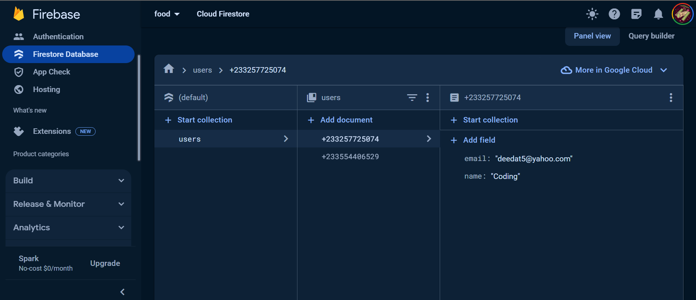

```markdown
# React Application README

This repository contains a React application structured as follows:

```
src
├── components
├── context
└── pages
```

## Tech Stack

- **React**: A JavaScript library for building user interfaces.
- **Vite**: A fast and modern build tool that serves your code via native ES modules.
- **Firebase Hosting**: Hosting service provided by Firebase for deploying web apps quickly and securely.
- **Firebase Firestore**: Cloud Firestore is a flexible, scalable database for mobile, web, and server development from Firebase and Google Cloud Platform.
- **Firebase Authentication**: Firebase Authentication provides backend services, easy-to-use SDKs, and ready-made UI libraries to authenticate users to your app.

## Getting Started

To run the application locally, you can use the following commands:

```bash
npm install     # Install dependencies
npm run dev     # Start the development server
```

## Code Formatting

We use ESLint and Prettier for code formatting. To format the code, run:

```bash
npm run format
```

## Building the Application

To build the application for production, run:

```bash
npm run build
```

## Application URL

The deployed application can be accessed at [https://deedat-codama.web.app/](https://deedat-codama.web.app/).

## Screenshots


You can find screenshots of the firestore collection below
(./screenshot.png)